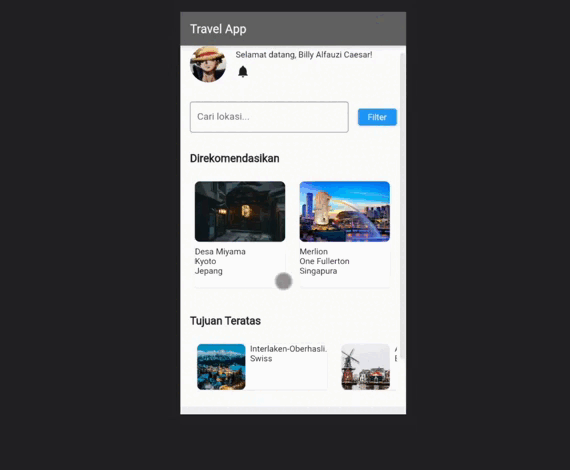

# UAS Pemrograman Mobile2
# App Travel Sederhana
## Profile
<body>
    <table border="1">
        <tr>
            <th> Nama</th>
            <th>NIM</th>
            <th>Kelas</th>
        </tr>
        <tr>
            <td>Billy Alfauzi Caesar</td>
            <td>312110152</td>
            <td>TI.21.A.1</td>
        </tr>
    </table>
</body>

## Start
- Flutter adalah sebuah framework open-source yang digunakan untuk membangun aplikasi mobile, web, dan desktop dengan menggunakan satu basis kode.

- Dalam Flutter, _UI (User Interface)_ dibangun menggunakan komponen-komponen widget. Widget adalah sebuah konsep fundamental dalam Flutter yang merepresentasikan bagian-bagian dari tampilan UI.

## Pengerjaan & Penjelasan
**Membuat App travel sederhana dengan kode atau perintah yang sangat simple. Disini saya hanya akan menjelaskan secara singkat proses pembuatan aplikasi tersebut.**

- Pada app ini saya menggunakan widget-widget seperti MaterialApp, Scaffold, Column, Container, Text, Image, ListView, dan sebagainya untuk membangun tampilan aplikasi.

- Disini juga menggunakan pengaturan tata letak seperti SizedBox, Padding, dan Expanded untuk mengatur penempatan dan tata letak widget-widget di dalam tampilan.

- Tidak lupa melibatkan penggunaan data statis yang disimpan dalam bentuk list of maps (List<Map<String, String>>) untuk merepresentasikan lokasi yang direkomendasikan dan destinasi teratas.

- Selain itu juga dilakukan beberapa perubahan tampilan seperti mengubah warna header (AppBar) dengan menggunakan properti backgroundColor pada AppBar widget.

- And last, saya menambahkan deskripsi aplikasi pada bagian footer dengan menggunakan Container.


***Noted : Pastikan bahwa asset gambar yang digunakan ada pada direktori yang sesuai dan telah didefinisikan dengan benar di file, & Jangan lupa untuk menjalankan perintah flutter pub get setelah mengubah `pubspec.yaml` untuk memperbarui dependensi proyek.***

semisal :

```
 assets:
    - assets/location1.jpg
    - assets/location2.jpg
    - assets/location3.jpg
    - assets/destination1.jpg
    - assets/destination2.jpg
    - assets/destination3.jpg
    - assets/profile_image.jpg
```


# Output



## Done

# Panjang Umur Untuk Semua Hal-Hal Baik